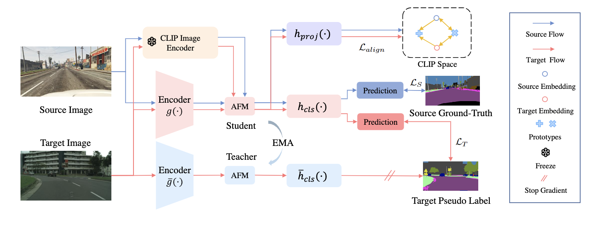

<<<<<<< HEAD
<<<<<<< HEAD
# CLIP-ProCL: Unsupervised Domain Adaptive Semantic Segmentation Based on CLIP-guided Prototypical Contrastive Learning
## Overview
### Introduction
Domain adaptive semantic segmentation aims to improve the model performance by bridging the gap existing between source and target domains. Recent works show that prototypical contrastive learning is a powerful approach. However, the prototypes can become unstable when there are significant variations in visual characteristics (e.g., color, scale and shape) among different images. Additionally, the prototypes generated from the source domain are highly correlated with domain information, which limits further gains in domain alignment. To address these issues, we propose a new method based on CLIP-guided Prototypical Contrastive Learning (CLIP-ProCL). Our approach simultaneously combines the rich text knowledge and image knowledge of CLIP to perform domain alignment. Towards the former, we obtain robust and domain-agnostic prototypes through the utilization of text prompts. Towards the latter, we leverage the image priors of CLIP to further guide the features learned by the segmentation network closer to the CLIP space. Experiments on the benchmark tasks GTA5 $\rightarrow$  Cityscapes and SYNTHIA $\rightarrow$ Cityscapes demonstrate that our approach outperforms the state-of-the-art methods.



### Result

|        UDA  Scenarios         | mIoU-19 | mIoU-16 | mIoU-13 |
| :---------------------------: | :-----: | :-----: | :-----: | 
|      GTA5-to-Cityscapes       |  60.1   |    -    |    -    |
|     SYNTHIA-to-Cityscapes     |    -    |  57.8   |  65.7   |

### Setup Environment

For this project, we used python 3.8.5. We recommend setting up a new virtual
environment:

```shell
python -m venv ~/venv/CLIP-ProCL
source ~/venv/CLIP-ProCL/bin/activate
# or use conda
conda create -n CLIP-ProCL python=3.8
```

In that environment, the requirements can be installed with:

```shell
pip install -r requirements.txt -f https://download.pytorch.org/whl/torch_stable.html
pip install mmcv-full==1.3.7  # requires the other packages to be installed first
```

Please, download the checkpoint of [CLIP-ProCL on GTA→Cityscapes](https://drive.google.com/file/d/1QVSbS42cI9EkWf3IiCLuM7xA9ISKftVz/view?usp=sharing) and extract it to the folder `pretrained/`.

All experiments were executed on an NVIDIA RTX 3090.
### Setup Datasets

**Cityscapes:** Please, download leftImg8bit_trainvaltest.zip and
gt_trainvaltest.zip from [here](https://www.cityscapes-dataset.com/downloads/)
and extract them to `data/cityscapes`.

**GTA:** Please, download all image and label packages from
[here](https://download.visinf.tu-darmstadt.de/data/from_games/) and extract
them to `data/gta`.

**Synthia (Optional):** Please, download SYNTHIA-RAND-CITYSCAPES from
[here](http://synthia-dataset.net/downloads/) and extract it to `data/synthia`.

The final folder structure should look like this:

```none
DAFormer
├── ...
├── data
│   ├── cityscapes
│   │   ├── leftImg8bit
│   │   │   ├── train
│   │   │   ├── val
│   │   ├── gtFine
│   │   │   ├── train
│   │   │   ├── val
│   ├── gta
│   │   ├── images
│   │   ├── labels
│   ├── synthia (optional)
│   │   ├── RGB
│   │   ├── GT
│   │   │   ├── LABELS
├── ...
```

**Data Preprocessing:** Finally, please run the following scripts to convert the label IDs to the
train IDs and to generate the class index for RCS:

```shell
python tools/convert_datasets/gta.py data/gta --nproc 8
python tools/convert_datasets/cityscapes.py data/cityscapes --nproc 8
python tools/convert_datasets/synthia.py data/synthia/ --nproc 8
```

## Training
The training code will be updated soon!
## Testing & Predictions

The provided CLIP-ProCL checkpoint trained on GTA→Cityscapes can be tested on the
Cityscapes validation set using:

```shell
sh test.sh pretrained/231025_1955_gta2cs_uda_warm_rcs_deeplabv2red_final_pl_8e0a4
```
## Acknowledgements

This project is based on the following open-source projects. We thank their
authors for making the source code publically available.
* [MMSegmentation](https://github.com/open-mmlab/mmsegmentation)
* [SegFormer](https://github.com/NVlabs/SegFormer)
* [DACS](https://github.com/vikolss/DACS)
* [DAFormer](https://github.com/lhoyer/DAFormer)
=======
# CLIP-ProCL
>>>>>>> 0e48ad8a4eae9ac71522d219ea94e5d9069c6013
=======
# CLIP-ProCL
code for paper xxx
>>>>>>> 8244e785f196f0cca164502a4a9c60349468528d
